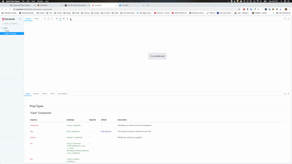

# storybook-dark-mode

A storybook addons that lets your users toggle between dark and light mode.



## Installation

Install the following npm module:

```sh
npm i --save-dev storybook-dark-mode
```

or with yarn:

```sh
yarn add -D storybook-dark-mode
```

Then, add following content to .storybook/addons.js

```js
import 'storybook-dark-mode/register';
```

## Configuration

Configure the dark and light mode by adding the following to you `config.js` file:

```js
import { addParameters } from '@storybook/react'; // or any other type of storybook

addParameters({
  darkMode: {
    // Override the default dark theme
    dark: { ...themes.dark, appBg: 'black' },
    // Override the default light theme
    light: { ...themes.normal, appBg: 'red' }
  }
});
```

## Story integration

If your components use a custom Theme provider, you can integrate it by using the provided hook.

```js
import { useDarkMode } from 'storybook-dark-mode';
import { addDecorator } from '@storybook/react';

// your theme provider
import ThemeContext from './theme';

// create a component that uses the dark mode hook
function ThemeWrapper(props) {
  // render your custom theme provider
  return (
    <ThemeContext.Provider value={useDarkMode() ? darkTheme : defaultTheme}>
      {props.children}
    </ThemeContext.Provider>
  );
}

addDecorator(renderStory => <ThemeWrapper>{renderStory()}</ThemeWrapper>);
```

You can also listen for the `DARK_MODE` event via the addons channel.

```js
import addons from '@storybook/addons';
import { addDecorator } from '@storybook/react';

// your theme provider
import ThemeContext from './theme';

// get channel to listen to event emitter
const channel = addons.getChannel();

// create a component that listens for the DARK_MODE event
function ThemeWrapper(props) {
  // this example uses hook but you can also use class component as well
  const [isDark, setDark] = useState(false);

  useEffect(() => {
    // listen to DARK_MODE event
    channel.on('DARK_MODE', setDark);
    return () => channel.off('DARK_MODE', setDark);
  }, [channel, setDark]);

  // render your custom theme provider
  return (
    <ThemeContext.Provider value={isDark ? darkTheme : defaultTheme}>
      {props.children}
    </ThemeContext.Provider>
  );
}

addDecorator(renderStory => <ThemeWrapper>{renderStory()}</ThemeWrapper>);
```
